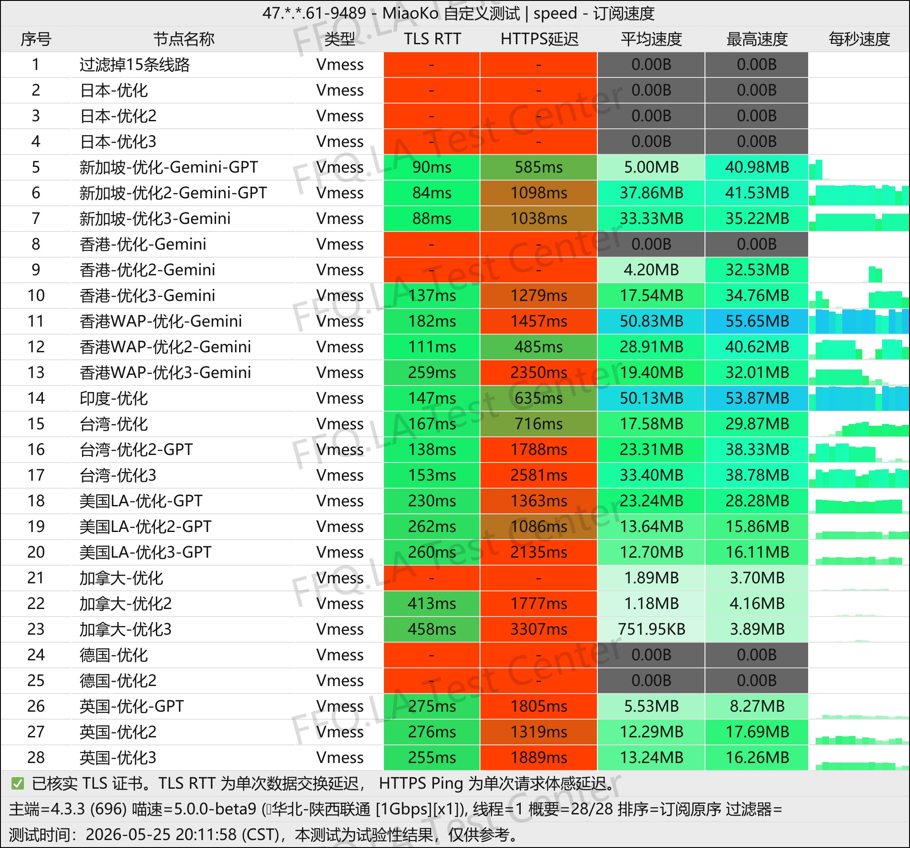
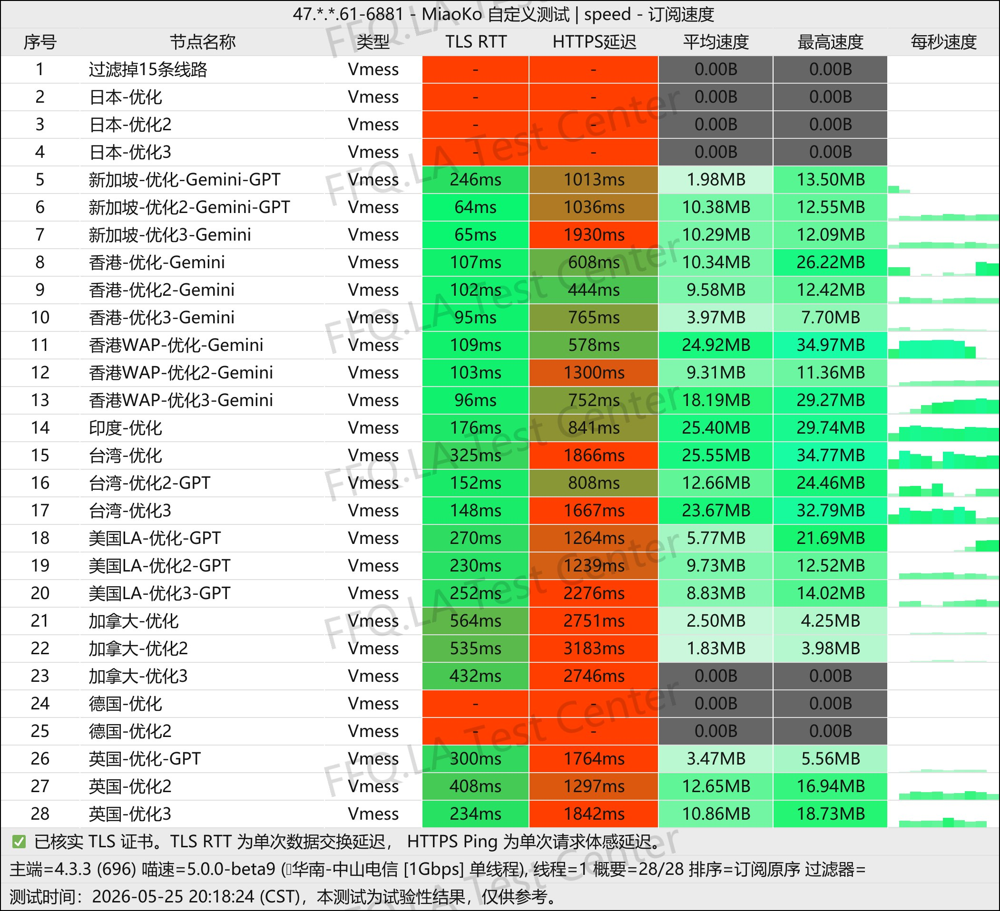
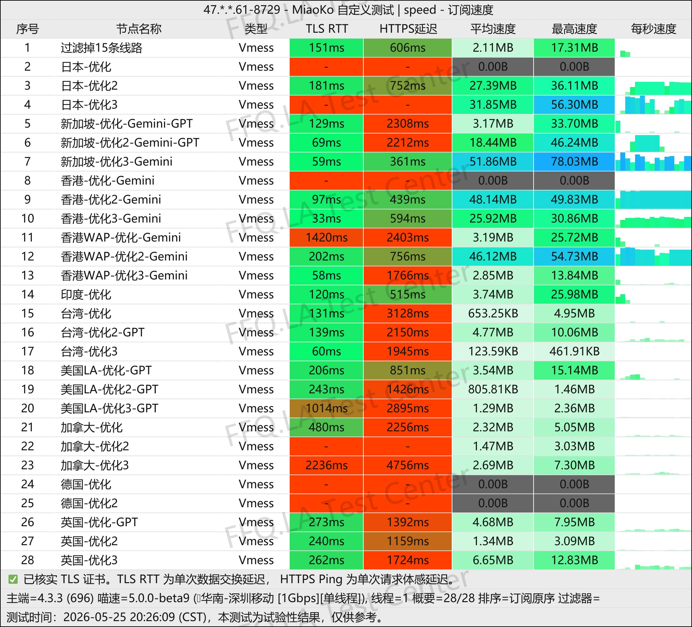
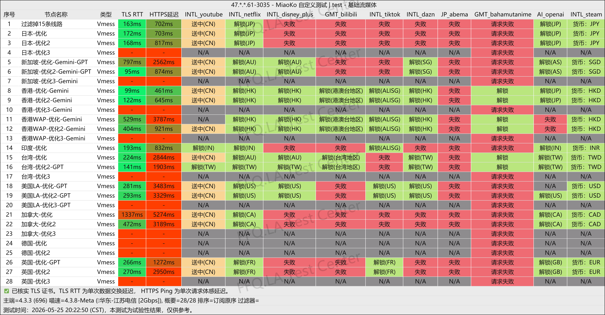
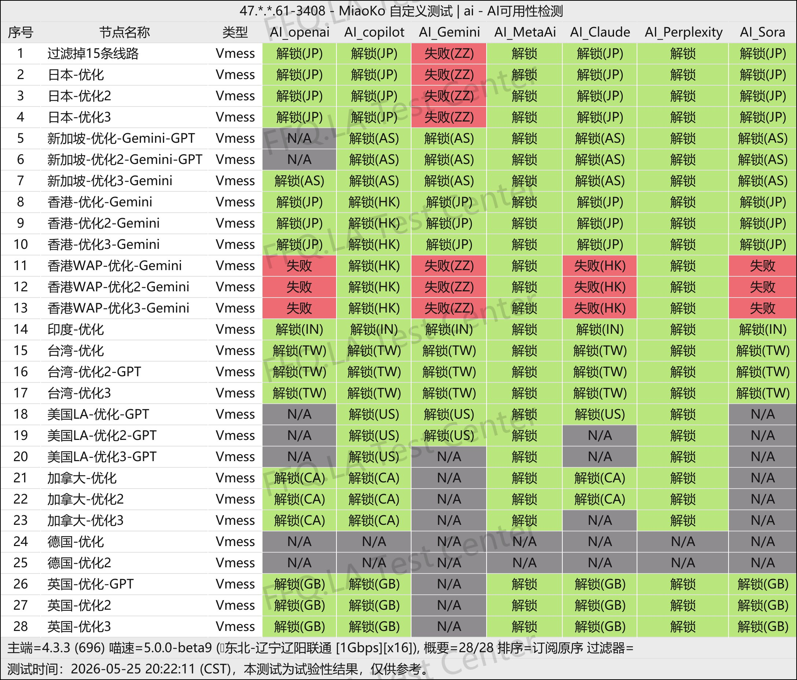
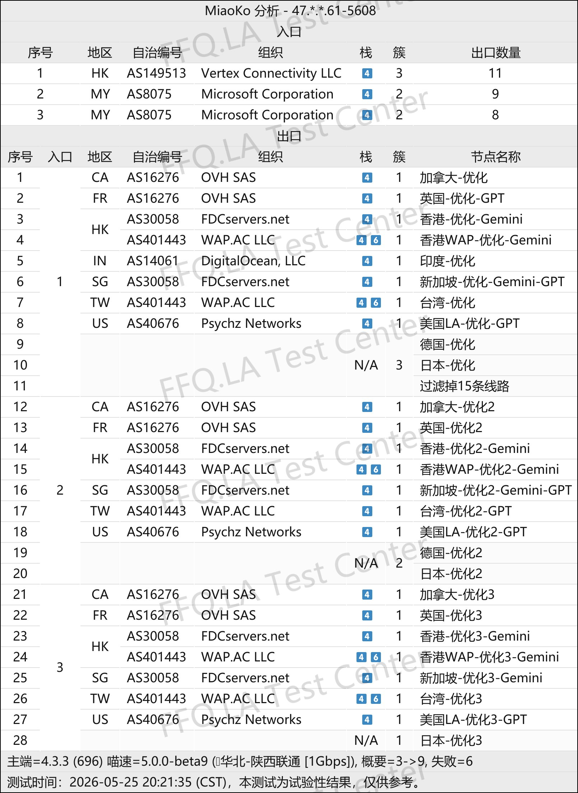

# Mojie (魔戒机场): официальные адреса сайта и руководство **(Обновлено 2026-10-08)**

[简体中文](README.md) · [繁體中文](README.zh-TW.md) · [English](README.en.md) · [日本語](README.ja.md) · [한국어](README.ko.md) · **Русский**

Этот проект официально публикуется и поддерживается командой Mojie. Здесь собраны адреса сайта, даты их обновления, архивные результаты тестирования и ответы на вопросы о доступе, тарифах, клиентах и подписках. В репозитории также есть статическая страница со ссылками для доступа.

**Адреса обновлены 2026-10-08 (пекинское время, UTC+8)**

[Официальные адреса](#official-links) · [Тесты и анализ](#performance) · [Проблемы с доступом](#troubleshooting) · [Тарифы и клиенты](#plans) · [Частые вопросы](#faq)

## Официальные адреса сайта Mojie

Приведённые ниже адреса поддерживает официальная команда Mojie. Откройте ссылку или скопируйте адрес для дальнейшего использования. При изменении адресов ориентируйтесь на этот список.

| Ссылка | Адрес |
| --- | --- |
| Адрес 1 | [mojiegjc.com](https://mojiegjc.com/) |
| Адрес 2 | [mojieggw.com](https://mojieggw.com/) |
| Адрес 3 | [mojiegjsq.com](https://mojiegjsq.com/) |
| Адрес 4 | [mojie-vpn.com](https://mojie-vpn.com/) |

Выберите любой адрес. Если он недоступен в вашей сети, попробуйте другой. Несколько доменов могут вести к одной службе регистрации; это не означает, что каждому из них соответствует независимый прокси-узел или отдельный резервный сервис.

## Архивные тесты производительности и анализ

В этом разделе приведены архивные снимки результатов тестирования и их разбор. На всех шести изображениях указана дата **2026-05-25**. Это не новые измерения и не результаты мониторинга в реальном времени. Фактическая производительность зависит от региона, интернет-провайдера, времени и узла. Надписи на изображениях сохранены в исходном виде; основные результаты поясняются на русском языке.

Для значений скорости сохранены обозначения **MB** и **KB**, указанные на изображениях: они не заменяются на Mbps. TLS RTT, задержка HTTPS и скорость загрузки — разные показатели. Всё время тестирования ниже указано по Пекину (CST, UTC+8).

### 1.1 China Unicom: скорость в вечерние часы пик

Время на изображении: **2026-05-25 20:11:58 CST**. Условия: China Unicom, провинция Шэньси · 1 Gbps · один поток.

У оптимизированного узла Hong Kong WAP средняя скорость составила **50.83 MB**, максимальная — **55.65 MB**. Оптимизированный узел в Индии показал среднюю скорость **50.13 MB**. Для некоторых узлов в Японии и Германии отображается **0.00B** или отсутствует результат измерения задержки; сравнивайте показатели по полной таблице.

### 1.2 China Telecom: скорость в вечерние часы пик

Время на изображении: **2026-05-25 20:18:24 CST**. Условия: China Telecom, Чжуншань · 1 Gbps · один поток.

Средняя скорость оптимизированного узла на Тайване составила **25.55 MB**, а максимальная скорость оптимизированного узла Hong Kong WAP — **34.97 MB**. Один и тот же узел показал разные результаты в сетях China Telecom и China Unicom. Максимальная скорость сама по себе не описывает скорость длительной загрузки.

### 1.3 China Mobile: скорость в вечерние часы пик

Время на изображении: **2026-05-25 20:26:09 CST**. Условия: China Mobile, Шэньчжэнь · 1 Gbps · один поток.

Узел Singapore optimized 3 показал среднюю скорость **51.86 MB** и максимальную **78.03 MB**. Средняя скорость узла Hong Kong optimized 2 составила **48.14 MB**. Некоторые узлы на Тайване и в США показали более низкие результаты. При выборе узла учитывайте задержку, среднюю скорость и её колебания.

### 2.1 Доступ к стриминговым и другим сервисам

Время на изображении: **2026-05-25 20:22:50 CST**. Условия: China Telecom, провинция Цзянсу · 2 Gbps.

В отчёт входят YouTube, Netflix, Disney+, Bilibili, TikTok, DAZN, Abema, Bahamut Anime, OpenAI и Steam. Результаты включают регионы доступа, неудачные проверки и **N/A**. Регион в названии узла может отличаться от региона, определяемого платформой.

### 2.2 Доступ к сервисам ИИ

Время на изображении: **2026-05-25 20:22:11 CST**. Условия: China Unicom, Ляоян, провинция Ляонин · 1 Gbps · на изображении указано x16.

В отчёт входят OpenAI, Copilot, Gemini, Meta AI, Claude, Perplexity и Sora. Результаты различаются между платформами: некоторые узлы в Японии не прошли проверку Gemini, а некоторые узлы Hong Kong WAP — проверки OpenAI, Claude и Sora. Эти данные не подтверждают доступность всех сервисов на каждом узле.

### 3. Анализ входных и выходных узлов сети

Время на изображении: **2026-05-25 20:21:35 CST**. Условия: China Unicom, провинция Шэньси · 1 Gbps.

На изображении указаны регионы входа и выхода, ASN, организации и соответствия между узлами. Сводка: **«3 → 9, неудачных проверок = 6»**. Название узла может не совпадать с фактическим регионом выхода: например, для некоторых оптимизированных узлов с меткой Великобритании указан выходной регион **FR**. Эти записи не означают, что топология сети остаётся неизменной.

## Что делать, если сайт Mojie не открывается

| Что происходит | Что проверить сначала | Какой вывод можно сделать |
| --- | --- | --- |
| Истекло время ожидания или возникла ошибка DNS | Запишите домен и время, проверьте доступ к другим сайтам | В текущих условиях доступ не установлен; это не доказывает прекращение работы сервиса |
| Браузер предупреждает о сертификате или небезопасном соединении | Прекратите ввод данных аккаунта, проверьте домен и время на устройстве | Сначала устраните проблему с сертификатом или соединением; не обходите предупреждение |
| Страница открывается, но существующий аккаунт не работает | Проверьте введённые данные, страницу входа и ошибку; обратитесь в поддержку через страницу аккаунта | Доступ к сайту и вход в аккаунт — разные этапы |
| Сайт работает, но клиент не подключается | Проверьте срок действия подписки, остаток трафика и настройки клиента | Сайт и подключение к прокси-узлу нужно проверять отдельно |
| На разных страницах отличаются цены или условия | Посмотрите текущие тарифы, сроки действия и условия поддержки на странице аккаунта | Перед покупкой или продлением ориентируйтесь на действующие условия |

В сообщении о проблеме укажите домен, время по Пекину, выполненные действия, текст ошибки и конечный адрес страницы. Не публикуйте пароли, платёжные данные или URL подписки.

## Что проверить в тарифах и клиентах

На странице аккаунта сравните следующие условия:

- **Оплата и трафик:** Ежемесячная оплата или расчёт по объёму трафика, срок его действия, а также различия между пополнением баланса и покупкой тарифа.
- **Ограничения устройств:** Число устройств или одновременных подключений и совместимость с вашим телефоном, компьютером и клиентом.
- **Производительность:** Результаты из того же региона, сети провайдера и времени суток полезнее снимка скорости без описания условий.
- **Поддержка:** Каналы связи, условия возврата средств и порядок уведомления о сбоях.

Получайте клиент по проверенным инструкциям сервиса или из официального канала распространения самого клиента. URL подписки может содержать личные учётные данные; не размещайте его в публичных Issue или на снимках экрана.

## Частые вопросы

### Где найти актуальный официальный адрес Mojie?

Используйте список выше. Дата обновления адресов указана в начале документа. Откройте ссылку или добавьте страницу доступа в закладки. Если один домен временно недоступен, попробуйте другой адрес из списка.

### Как войти в существующий аккаунт или получить помощь?

Откройте сайт, выберите вход и используйте существующий аккаунт. При ошибке запишите сообщение, домен и время, затем обратитесь в поддержку через страницу аккаунта. Не отправляйте пароли, платёжные данные или URL подписки в публичные Issue.

### Чем отличаются адрес сайта, URL подписки и узел?

Сайт служит для просмотра информации и управления аккаунтом. URL подписки позволяет клиенту получить конфигурацию и может содержать личный ключ. Узел — это сетевой сервис, к которому подключается клиент. Работающий сайт не доказывает доступность узла и не означает, что проведён тест скорости.

### Гарантируют ли несколько доменов независимые резервные маршруты?

Нет. Несколько адресов позволяют попробовать другой домен при недоступности одного из них, но они могут вести на один сайт. Они не гарантируют независимость и не обозначают разные или более быстрые прокси-узлы.

### Где посмотреть цены и акции Mojie?

Текущие тарифы, цены и условия акций доступны на странице аккаунта. Перед покупкой проверьте срок действия трафика, ограничения устройств и правила возврата; перед продлением уточните, не изменились ли условия. Фактическая производительность также зависит от региона, провайдера и времени суток.

### Обновляется ли дата адресов автоматически?

Нет. Она меняется при обновлении списка адресов. Обычное редактирование текста или повторная сборка страницы не меняет её автоматически.

## Обновления и обратная связь

Фактические изменения доступны в истории коммитов этого репозитория. О неработающих ссылках, неожиданных переходах или ошибках в документации можно сообщить через Issue или предложение исправления. По вопросам аккаунта, тарифа и оплаты обращайтесь в поддержку через страницу аккаунта. Не включайте личные учётные данные в публичные сообщения.
